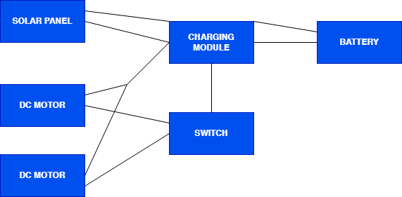

# ☀️ Solar-Powered Mini Car

A small-scale vehicle powered entirely by solar energy — built to demonstrate how a photovoltaic panel, a lithium-style charging module, and a rechargeable battery pack can be combined into a compact, self-sufficient power system.

Final project for **EED1014 – Engineering Design**, Dokuz Eylül University, Department of Electrical & Electronics Engineering.

---

## Overview

The goal was to build a remote-controlled car chassis that runs **solely on solar power**, with no reliance on grid electricity or single-use batteries. A 6V photovoltaic panel charges a NiMH battery pack through a TP4056 charging module, which then drives the car's DC motors.

The build focuses on three engineering questions:
- How much energy can a small (0.6 W) solar panel realistically deliver?
- How do you safely charge NiMH batteries with a module designed for Li-ion cells?
- What motor speed and runtime can you expect from a 4.8 V pack under real sunlight?

## How it works

1. The **solar panel** collects sunlight and outputs up to 0.6 W (6 V, 100 mA).
2. The **TP4056 charging module** regulates that power and safely charges the battery pack, providing overcharge, over-discharge, and short-circuit protection.
3. The **4.8 V NiMH battery pack** (4× 1.2 V, 2100 mAh in series) stores the energy.
4. A manual **switch** connects the pack to two parallel **DC motors**, which drive the car.

<table>
<tr>
<td width="50%">

TP4056 charging module — the wiring hub between panel, battery and motors

</td>
<td width="50%">

4× rechargeable AA NiMH cells (4.8 V pack) in the chassis battery bay

</td>
</tr>
</table>

## Bill of materials

| # | Component | Qty | Unit price (₺) | Total (₺) |
|---|---|---|---|---|
| 1 | Toy car chassis (with DC motors) | 1 | 300 | 300 |
| 2 | 6 V 100 mA solar panel | 1 | 100 | 100 |
| 3 | TP4056 charging module | 1 | 50 | 50 |
| 4 | 1.2 V 2100 mAh rechargeable NiMH battery | 4 | 150 | 600 |
| 5 | Misc. (wires, switch, tape) | 1 | 50 | 50 |
| | **Total** | | | **₺1100** |

## Key numbers

- **Panel output:** 6 V, 100 mA → 0.6 W under ideal sunlight
- **Battery pack:** 4 × 1.2 V, 2100 mAh NiMH in series → 4.8 V, 10.08 Wh
- **Theoretical full charge time:** ~16.8 h continuous ideal light (in practice: ~3 h full sun / ~6 h partial sun)
- **Motor speed:** ~240 rpm at 4.8 V → estimated linear speed ≈ 0.38 m/s
- **Measured range:** ~10 m on a flat indoor surface per full charge

## Video Demonstration

▶️ **[Watch the Test Drive & Drift Demo on YouTube](https://www.youtube.com/watch?v=L9RL3uXSAv0)**

---

## Build steps

1. **Component collection** — solar panel, TP4056 module, 4× NiMH AA batteries, toy car chassis.
2. **Battery configuration** — 4 cells wired in series for ~4.8 V, mounted in a holder on the chassis.
3. **TP4056 integration** — battery terminals wired to the module; `OUT+`/`OUT–` wired to the motor circuit.
4. **Solar panel mounting** — panel fixed on top with double-sided tape, wired to the module's `IN+`/`IN–`.
5. **Circuit completion** — polarity checked, joints soldered, wires insulated.
6. **Sunlight testing** — charge and motor response observed in direct and partial sunlight.
7. **Performance evaluation** — speed and charge efficiency compared across lighting conditions.

## Results

Under direct sunlight, the panel fully charged the 4.8 V pack in **~3 hours**; under partially cloudy conditions this stretched to **~6 hours**. On a full charge the car moved an average of **~10 meters** on a flat indoor surface, powered solely by the battery pack. The TP4056 module ran the full test cycle without tripping its overvoltage, thermal, or trickle-charge protections — confirming the system stayed within its intended voltage/current envelope.

---

## Team

Ömer Ege Nişli · Alp Kaptan · Muhammet Emre Ay · Rıdvan Efe Birben  
Course instructor: Reyat Yılmaz

---
Built as part of the EED1014 Engineering Design course, Dokuz Eylül University.
