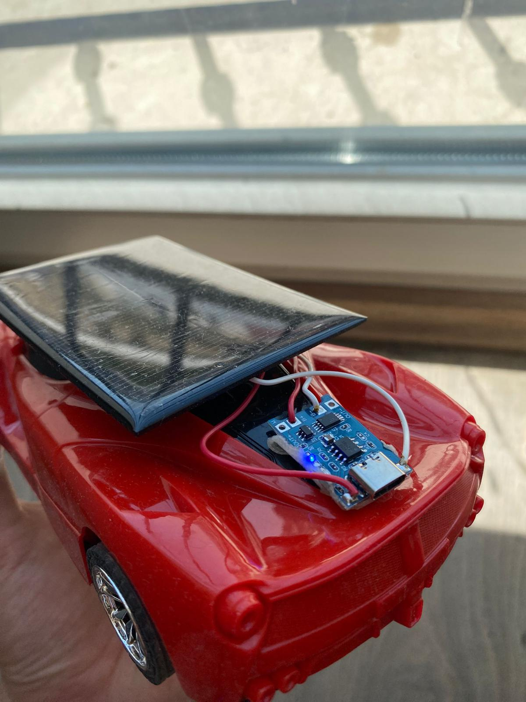
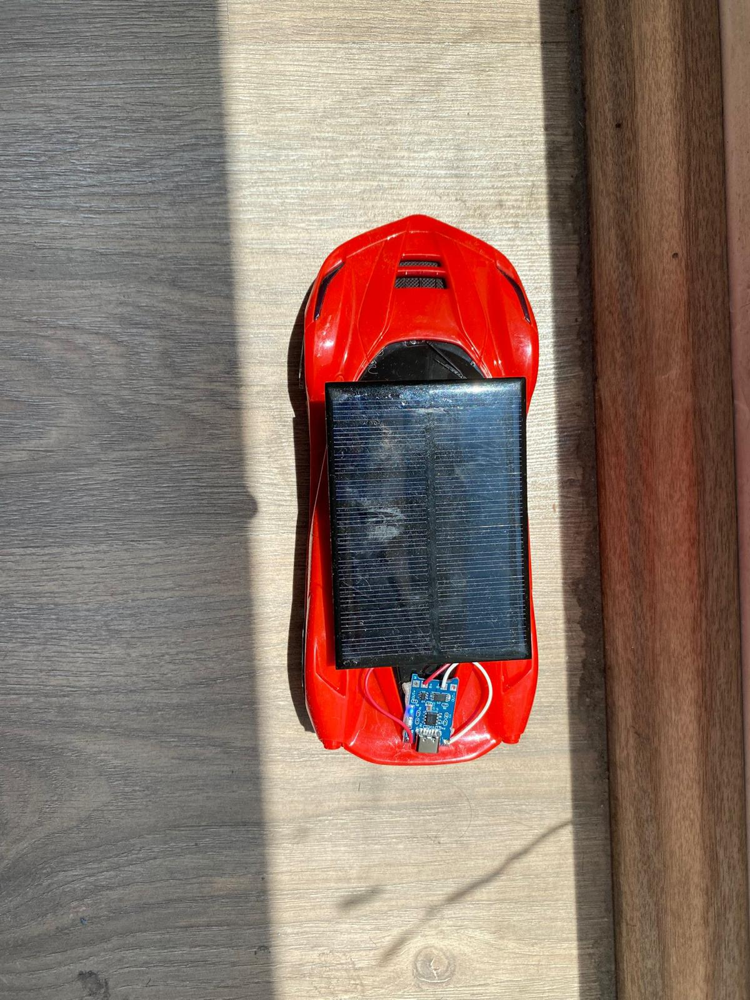
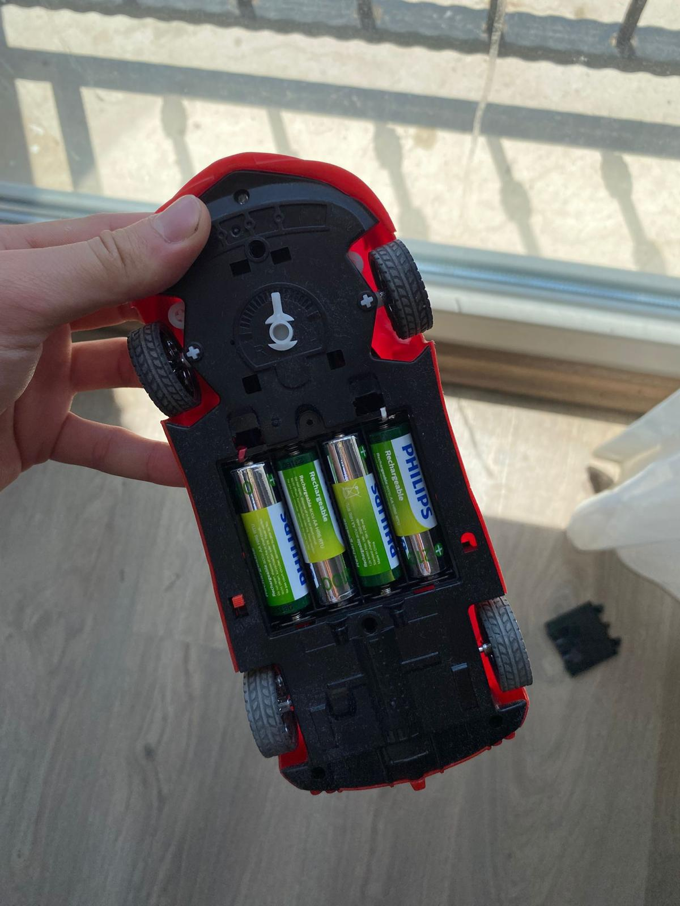

# ☀️ Solar-Powered Mini Car

A small-scale RC car chassis converted into a fully solar-charged vehicle — no batteries plugged into a wall, no fossil fuels, just a photovoltaic panel, a charging module, and rechargeable batteries turning sunlight into motion.

Final project for **EED1014 – Engineering Design**, Dokuz Eylül University, Faculty of Engineering, Department of Electrical and Electronics Engineering.

<p align="center">
  
  <br>
  <em>The charging circuit mounted at the rear — TP4056 module (blue LED lit), solar panel wiring, and battery leads.</em>
</p>

### 🎥 Video demo

▶️ **[Watch the test drive on YouTube](https://www.youtube.com/watch?v=L9RL3uXSAv0)**

## Overview

The car integrates a 6 V photovoltaic panel, a TP4056 charging module, and a 4.8 V NiMH battery pack to drive two small DC motors. Sunlight is converted to electrical energy by the panel, regulated and stored by the charging module, and discharged into the motors through a manual switch — the full chain from photon to motion, with no external power source involved.

The system was tuned for real-world sunlight conditions (panel angle, light intensity, charge/discharge rates) and successfully drove the vehicle on solar power alone, achieving an average of 10 m of continuous motion per full charge.

<table>
  <tr>
    <td width="50%" align="center">
      
      <br><sub>Assembled vehicle, panel mounted on the roof</sub>
    </td>
    <td width="50%" align="center">
      
      <br><sub>Top-down view of the panel placement</sub>
    </td>
  </tr>
</table>

<p align="center">
  
  <br><sub>Underside — 4× 1.2 V NiMH battery pack</sub>
</p>

## Components

| # | Component | Qty | Unit price (TRY) | Total (TRY) |
|---|---|---|---|---|
| 1 | Toy car base (with DC motors) | 1 | 300 | 300 |
| 2 | 6 V 100 mA solar panel | 1 | 100 | 100 |
| 3 | TP4056 charging module | 1 | 50 | 50 |
| 4 | 1.2 V 2100 mAh NiMH rechargeable battery | 4 | 150 | 600 |
| 5 | Miscellaneous (wires, switch, etc.) | 1 | 50 | 50 |
| | **Total** | | | **1100** |

**Key specs**

- **Solar panel:** 6 V, 100 mA (0.6 W under ideal sunlight), polycrystalline, ~110 mA short-circuit current
- **Battery pack:** 4 × 1.2 V, 2100 mAh NiMH in series → 4.8 V, 10.08 Wh total capacity
- **Charging module:** TP4056, 4.0–8.0 V input, 4.2 V ±1.5% charge voltage, up to 1000 mA programmable current (configured with protective resistors for safe NiMH charging)
- **Motors:** two DC motors, 3–6 V, ~240 rpm at the 4.8 V pack voltage (~0.377 m/s at the wheel)

Full electrical characteristics for each component are in the project report (`docs/`), Appendices A–C.

## Build steps

1. **Battery configuration** – wire four NiMH AA cells in series for ~4.8 V and mount them in a battery holder on the chassis.
2. **TP4056 integration** – connect the module to the battery terminals; wire OUT+/OUT– to the motor circuit.
3. **Solar panel mounting** – mount the 6 V panel on the roof with double-sided tape; wire its output to the module's IN+/IN– pins.
4. **Circuit completion** – check polarity, solder connections, and insulate all wiring to avoid shorts.
5. **Test under sunlight** – place the car in direct sunlight and observe charging and motor behavior.

## Results

- Full charge in direct sunlight: **~3 hours** (extends to ~6 hours under partial cloud cover)
- Post-charge run: **~10 m** of continuous motion on a flat indoor surface
- The TP4056 module held safe voltage/current thresholds throughout testing, with no overvoltage or thermal trips

Charging efficiency was the main limiting factor — the 100 mA panel current stretches charge time in low light. Future iterations could add solar tracking, higher-efficiency or parallel panels, and wireless control.

## System architecture & circuit design

Current flows from the solar panel through the TP4056 module into the battery pack, and from there through a manual switch to the two DC motors:

<p align="center">
  
  <br><sub>Figure 3.1 — System block diagram</sub>
</p>

## Repository contents

```
├── README.md
├── LICENSE
├── docs/
│   ├── Solar-Powered-Mini-Car-Report.docx   # full final technical report
│   └── Solar-Powered-Mini-Car-Report.pdf    # same report, PDF
└── images/
    ├── circuit-closeup.jpg
    ├── car-front.jpg
    ├── top-view.jpg
    ├── battery-compartment.jpg
    └── circuit-block-diagram.png
```

The [full report](docs/Solar-Powered-Mini-Car-Report.pdf) covers the complete design rationale, charge-time and speed calculations, procedure, budget, and appendices with component datasheets.

## References

- [6V 100mA Solar Panel](https://www.mathaelectronics.com/product/6v-100ma-solar-panel/)
- [TP4056 Datasheet (LCSC)](https://datasheet.lcsc.com/lcsc/2311091738_UMW-Youtai-Semiconductor-Co---Ltd--TP4056_C725790.pdf)
- [TP4056 Datasheet (alt., LCSC)](https://datasheet.lcsc.com/lcsc/1811151611_TPOWER-TP4056_C16581.pdf)
- [Adafruit — Li-Ion charger reference](https://www.adafruit.com/product/1904)

## Team

Final project for EED1014 – Engineering Design, instructed by **Reyat Yılmaz**.

- Ömer Ege Nişli
- Alp Kaptan
- Muhammet Emre Ay
- Rıdvan Efe Birben

## More

- Build videos and demos: [YouTube — @omerege3495](https://www.youtube.com/@omerege3495)

## License

Released under the [MIT License](LICENSE).
